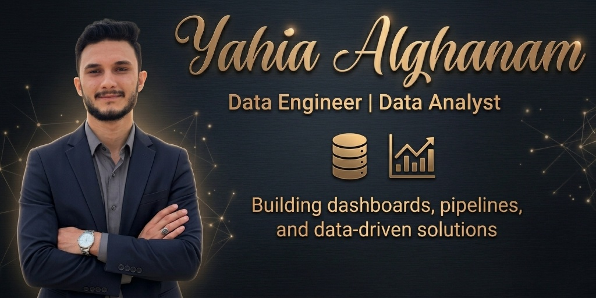

  

---

# Hi there, I'm Yahia Alghanam 👋

## Data Analyst | Data Engineer

I’m passionate about transforming raw data into actionable insights using **SQL, Python, Power BI, Excel, and ETL workflows**.  
I enjoy building analytical solutions, designing data pipelines, and creating dashboards that support data-driven decision-making.

---

## About Me

I’m a **Data Analyst** and **Data Engineer** with experience in working with data across different stages, from extraction and cleaning to analysis, visualization, and reporting.  
I use tools like **Python, SQL, Excel, Power BI, ETL processes, and Data Warehousing** to solve real-world problems and turn complex data into meaningful insights.

I am always looking to improve my skills in **data engineering, analytics, automation, and machine learning** while contributing to impactful projects.

---

## Technical Skills

- **Languages:** Python, SQL  
- **Databases:** SQL Server, MySQL  
- **Data Analysis:** Pandas, NumPy, SciPy, Matplotlib  
- **BI Tools:** Power BI, Excel  
- **Excel Skills:** VLOOKUP, Conditional Formatting, Pivot Tables  
- **Web Scraping:** Requests, BeautifulSoup, Scrapy, Selenium  
- **Data Engineering:** ETL, Data Warehousing, Database Management  
- **Other Areas:** Machine Learning, Data Cleaning, Data Visualization  

---

## Featured Projects

### 📊 Sales Dashboard Project
Built an interactive dashboard to monitor sales KPIs, trends, and business performance.  
**Tools:** Power BI, Excel, SQL

### 🐍 Data Cleaning with Python
Cleaned and transformed raw datasets using Python libraries for better analysis and reporting.  
**Tools:** Python, Pandas, NumPy, Jupyter Notebook

### 🗄️ SQL Data Exploration Project
Performed data exploration and analysis using SQL queries to uncover patterns and insights.  
**Tools:** SQL Server / MySQL

### ⚙️ ETL Data Pipeline Project
Designed ETL workflows to extract, transform, and load data into structured databases for analysis.  
**Tools:** Python, SQL, ETL Concepts

---

## Currently Working On

- Building more **data analysis projects** with Python and SQL  
- Creating **interactive dashboards** in Power BI  
- Improving my **data engineering skills** in ETL and data warehousing  
- Exploring practical applications of **machine learning**  

---

## Connect With Me

- 📧 **Email:** yahiaelghanam99@gmail.com  
- 💼 **LinkedIn:** [https://www.linkedin.com/in/yahia-alghanam/](https://www.linkedin.com/in/yahia-alghanam/)  
- 🌐 **Portfolio:** [https://yahiaalghanam.github.io/Portfolio/](https://yahiaalghanam.github.io/Portfolio/)  
- 💻 **GitHub:** [https://github.com/yahiaalghanam](https://github.com/yahiaalghanam)

---

## Let's Collaborate

Feel free to explore my repositories, and connect with me if you'd like to collaborate on **data analysis, dashboards, SQL projects, ETL pipelines, or data engineering opportunities**.
